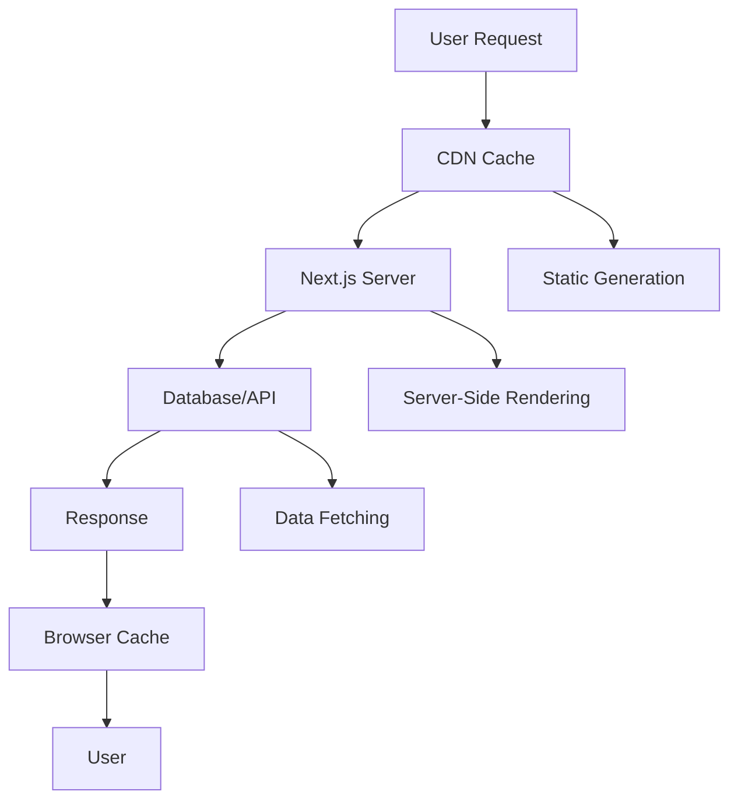
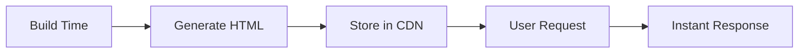
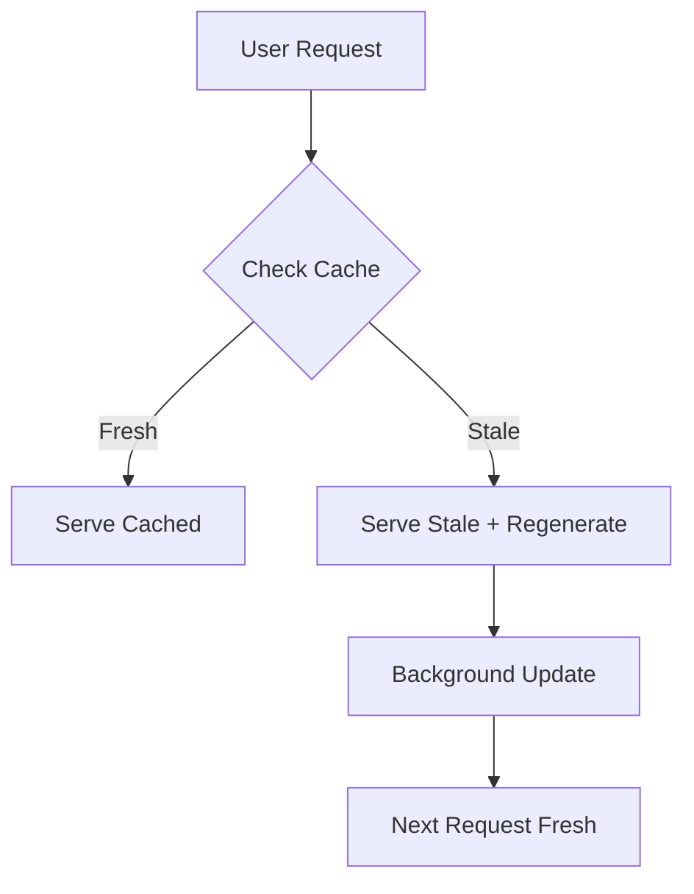
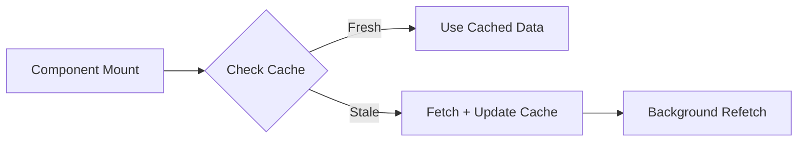
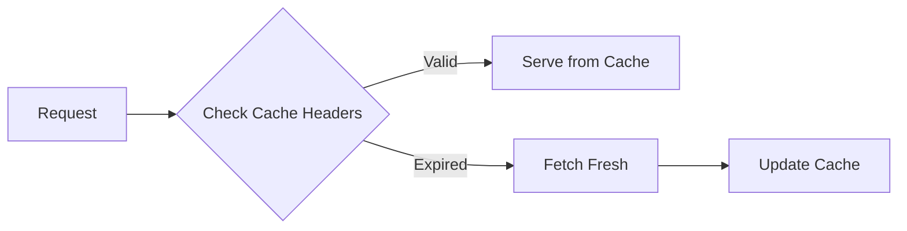

# Caching Strategy trong NextJS - Hướng Dẫn Chi Tiết

## 📋 Mục Lục

1. [Giới Thiệu Tổng Quan](#giới-thiệu-tổng-quan)
2. [Mục Đích và Lợi Ích của Caching](#mục-đích-và-lợi-ích-của-caching)
3. [Các Loại Cache trong NextJS](#các-loại-cache-trong-nextjs)
4. [Chiến Lược Caching Chi Tiết](#chiến-lược-caching-chi-tiết)
5. [Phân Tích Source Code Thực Tế](#phân-tích-source-code-thực-tế)
6. [Best Practices và Optimization](#best-practices-và-optimization)
7. [Kết Luận và Khuyến Nghị](#kết-luận-và-khuyến-nghị)

---

## 🚀 Giới Thiệu Tổng Quan

### 🔍 Caching là gì?

**Caching** là kỹ thuật lưu trữ dữ liệu tạm thời để:

- ⚡ **Tăng tốc độ truy cập** - Không cần fetch lại từ server
- 💰 **Giảm chi phí** - Ít requests đến database/API
- 🎯 **Cải thiện trải nghiệm người dùng** - Load nhanh hơn
- 📊 **Tăng khả năng chịu tải** - Server ít bị quá tải

### 🎯 Tại sao NextJS cần Caching?

NextJS là **full-stack framework** với nhiều layer khác nhau:



**Mỗi layer đều cần caching strategy riêng biệt.**

---

## 🎯 Mục Đích và Lợi Ích của Caching

### 🎯 **Mục Đích Chính**

#### 1. **Performance Optimization**

- ⚡ **Giảm Time to First Byte (TTFB)**
- 🚀 **Tăng Core Web Vitals scores**
- 📱 **Cải thiện mobile performance**

#### 2. **Resource Management**

- 💰 **Giảm server load**
- 🔋 **Tiết kiệm bandwidth**
- 🗄️ **Giảm database queries**

#### 3. **User Experience**

- 🎯 **Instant page loads**
- 🔄 **Smooth navigation**
- 📊 **Consistent data across sessions**

### 📊 **Lợi Ích Cụ Thể**

| Metric               | Không Cache  | Có Cache    | Cải Thiện  |
| -------------------- | ------------ | ----------- | ---------- |
| **Page Load Time**   | 2-3 giây     | 200-500ms   | **80-85%** |
| **Server CPU Usage** | 100%         | 20-30%      | **70-80%** |
| **Database Queries** | 1000 req/min | 100 req/min | **90%**    |
| **CDN Hit Rate**     | 0%           | 85-95%      | **85-95%** |

---

## 🗂️ Các Loại Cache trong NextJS

### 1. **Static Generation Cache (SSG)**

#### 🔧 Cách Hoạt Động



#### 📝 Ví Dụ Thực Tế

```tsx
// src/app/[locale]/(public)/page.tsx - SSG với Data
export default async function Home() {
  // ✅ Data được fetch tại BUILD TIME và cache
  const result = await dishApiRequest.list()
  const dishList = result.payload.data

  return (
    <div>
      {dishList.map((dish) => (
        <DishCard key={dish.id} dish={dish} />
      ))}
    </div>
  )
}
```

**Lợi ích:**

- ⚡ **Ultra-fast loading** - HTML đã sẵn sàng
- 🌐 **Global CDN caching** - Cache toàn cầu
- 💰 **Zero server cost** - Không cần server processing

### 2. **Incremental Static Regeneration (ISR)**

#### 🔧 Cách Hoạt Động



#### 📝 Ví Dụ Thực Tế

```tsx
// src/app/[locale]/(public)/dishes/[slug]/page.tsx
import { cache } from 'react'

// ✅ Cache function để tối ưu performance
const getDetail = cache((id: number) => wrapServerApi(() => dishApiRequest.getDish(id)))

export default async function DishPage({ params }) {
  const id = getIdFromSlugUrl(params.slug)
  const data = await getDetail(id) // ✅ Cached result

  return <DishDetail dish={data?.payload?.data} />
}
```

**Lợi ích:**

- ⚡ **Performance của SSG** + 🔄 **Flexibility của SSR**
- 🎯 **Best of both worlds**
- 📊 **Configurable revalidation time**

### 3. **React Query Cache (Client-Side)**

#### 🔧 Cách Hoạt Động



#### 📝 Ví Dụ Thực Tế

```tsx
// src/components/app-provider.tsx
const queryClient = new QueryClient({
  defaultOptions: {
    queries: {
      staleTime: 5 * 60 * 1000, // ✅ 5 phút - data vẫn fresh
      gcTime: 10 * 60 * 1000, // ✅ 10 phút - cache longer
      refetchOnWindowFocus: false,
      retry: (failureCount, error: any) => {
        if (error?.status === 401) return false // ✅ Không retry auth errors
        return failureCount < 2
      }
    }
  }
})
```

**Lợi ích:**

- 🔄 **Smart invalidation** - Chỉ refetch khi cần
- 📱 **Offline support** - Cache data locally
- 🎯 **Optimistic updates** - UI update ngay lập tức

### 4. **HTTP Cache (Browser/CDN)**

#### 🔧 Cách Hoạt Động



#### 📝 Ví Dụ Thực Tế

```tsx
// src/apiRequests/dish.ts
const dishApiRequest = {
  list: () =>
    http.get<DishListResType>('dishes', {
      next: { tags: ['dishes'] } // ✅ Cache tag cho revalidation
    }),
  getDish: (id: number) => http.get<DishResType>(`dishes/${id}`)
}
```

**Lợi ích:**

- 🌐 **CDN caching** - Cache toàn cầu
- 📱 **Browser caching** - Cache local
- ⚡ **Instant loading** - Không cần network request

---

## 🎯 Chiến Lược Caching Chi Tiết

### 1. **Static Content Strategy**

#### 🎯 **Khi nào sử dụng:**

- 📄 **Landing pages**
- 📚 **Blog posts**
- 🏢 **About pages**
- 📋 **Documentation**

#### 📝 **Implementation:**

```tsx
// ✅ Static pages - không cần data
export default function About() {
  return (
    <div>
      <h1>Về chúng tôi</h1>
      <p>Nội dung tĩnh...</p>
    </div>
  )
}

// ✅ Static pages với data - ISR
export default async function BlogList() {
  const posts = await getBlogPosts()

  return (
    <div>
      {posts.map((post) => (
        <BlogCard key={post.id} post={post} />
      ))}
    </div>
  )
}
```

### 2. **Dynamic Content Strategy**

#### 🎯 **Khi nào sử dụng:**

- 📊 **User dashboards**
- 🛒 **E-commerce products**
- 🔍 **Search results**
- 👤 **Personalized content**

#### 📝 **Implementation:**

```tsx
// ✅ Dynamic content với React Query
'use client'
export default function Dashboard() {
  const { data: userData } = useUserQuery()
  const { data: analytics } = useAnalyticsQuery()

  return (
    <div>
      <UserProfile user={userData} />
      <AnalyticsChart data={analytics} />
    </div>
  )
}

// ✅ Server-side data với cache
export default async function ProductPage({ params }) {
  const product = await getProduct(params.id) // ✅ Cached

  return <ProductDetail product={product} />
}
```

### 3. **Hybrid Strategy (Khuyến Nghị)**

#### 🎯 **Kết hợp nhiều loại cache:**

```tsx
// ✅ Hybrid approach - SSG + Client Cache
export default async function HomePage() {
  // ✅ SSG: Static content
  const staticData = await getStaticData()

  return (
    <div>
      {/* Static content - SSG */}
      <HeroSection data={staticData} />

      {/* Dynamic content - Client cache */}
      <ClientComponent />
    </div>
  )
}

// ✅ Client component với React Query
;('use client')
function ClientComponent() {
  const { data } = useQuery({
    queryKey: ['dynamic-data'],
    queryFn: getDynamicData,
    staleTime: 5 * 60 * 1000 // ✅ 5 phút cache
  })

  return <DynamicContent data={data} />
}
```

---

## 📝 Phân Tích Source Code Thực Tế

### 🔍 **1. React Cache Implementation**

#### **File:** `src/app/[locale]/(public)/dishes/[slug]/page.tsx`

```tsx
import { cache } from 'react'

// ✅ Cache function để tối ưu performance
const getDetail = cache((id: number) => wrapServerApi(() => dishApiRequest.getDish(id)))

export default async function DishPage({ params }) {
  const id = getIdFromSlugUrl(params.slug)
  const data = await getDetail(id) // ✅ Cached result

  return <DishDetail dish={data?.payload?.data} />
}
```

**Phân tích:**

- 🎯 **Cache function** - Tránh duplicate requests
- ⚡ **Performance boost** - Không fetch lại data đã có
- 🔄 **Automatic deduplication** - React tự động deduplicate

### 🔍 **2. React Query Cache Configuration**

#### **File:** `src/components/app-provider.tsx`

```tsx
const queryClient = new QueryClient({
  defaultOptions: {
    queries: {
      staleTime: 5 * 60 * 1000, // ✅ 5 phút - data vẫn fresh
      gcTime: 10 * 60 * 1000, // ✅ 10 phút - cache longer
      refetchOnWindowFocus: false,
      retry: (failureCount, error: any) => {
        if (error?.status === 401) return false // ✅ Không retry auth errors
        return failureCount < 2
      }
    }
  }
})
```

**Phân tích:**

- ⏰ **staleTime: 5 phút** - Data vẫn fresh trong 5 phút
- 🗂️ **gcTime: 10 phút** - Cache data trong 10 phút
- 🔄 **Smart retry** - Chỉ retry 2 lần, không retry auth errors

### 🔍 **3. HTTP Cache Tags**

#### **File:** `src/apiRequests/dish.ts`

```tsx
const dishApiRequest = {
  list: () =>
    http.get<DishListResType>('dishes', {
      next: { tags: ['dishes'] } // ✅ Cache tag cho revalidation
    }),
  getDish: (id: number) => http.get<DishResType>(`dishes/${id}`)
}
```

**Phân tích:**

- 🏷️ **Cache tags** - Đánh dấu cache để revalidate
- 🔄 **Selective invalidation** - Chỉ invalidate specific tags
- ⚡ **On-demand revalidation** - Revalidate khi cần

### 🔍 **4. Revalidation API**

#### **File:** `src/app/api/revalidate/route.ts`

```tsx
import { revalidateTag } from 'next/cache'

export async function GET(request: NextRequest) {
  const tag = request.nextUrl.searchParams.get('tag')
  revalidateTag(tag!) // ✅ Revalidate specific tag
  return Response.json({ revalidated: true, now: Date.now() })
}
```

**Phân tích:**

- 🎯 **Selective revalidation** - Chỉ revalidate specific tags
- ⚡ **On-demand updates** - Update cache khi cần
- 🔄 **Background revalidation** - Không block user request

---

## 🚀 Best Practices và Optimization

### 1. **Cache Strategy Selection**

#### 🎯 **Decision Framework:**

```
Câu hỏi quyết định:
1. Data có thay đổi thường xuyên không?
   ├─ Không → SSG
   └─ Có → Tiếp câu 2

2. Cần real-time data không?
   ├─ Không → ISR
   └─ Có → SSR + Client Cache

3. Performance quan trọng hơn data freshness?
   ├─ Có → ISR với revalidate time ngắn
   └─ Không → SSR
```

### 2. **Cache Configuration Optimization**

#### 📝 **React Query Configuration:**

```tsx
const queryClient = new QueryClient({
  defaultOptions: {
    queries: {
      // ✅ Optimized cache settings
      staleTime: 5 * 60 * 1000, // 5 phút
      gcTime: 10 * 60 * 1000, // 10 phút
      refetchOnWindowFocus: false,
      refetchOnReconnect: true,
      retry: (failureCount, error) => {
        if (error?.status === 401) return false
        return failureCount < 2
      }
    },
    mutations: {
      // ✅ Optimistic updates
      onMutate: async (variables) => {
        // Cancel outgoing refetches
        await queryClient.cancelQueries({ queryKey: ['data'] })

        // Snapshot previous value
        const previousData = queryClient.getQueryData(['data'])

        // Optimistically update
        queryClient.setQueryData(['data'], (old) => ({
          ...old,
          ...variables
        }))

        return { previousData }
      },
      onError: (err, variables, context) => {
        // Rollback on error
        queryClient.setQueryData(['data'], context?.previousData)
      }
    }
  }
})
```

### 3. **Cache Invalidation Strategy**

#### 📝 **Smart Invalidation:**

```tsx
// ✅ Thay vì invalidate toàn bộ
export const useUpdateDishMutation = () => {
  const queryClient = useQueryClient()

  return useMutation({
    mutationFn: ({ id, ...body }) => dishApiRequest.updateDish(id, body),
    onSuccess: (data, variables) => {
      // ✅ Update specific dish in cache
      queryClient.setQueryData(['dishes', variables.id], data)

      // ✅ Invalidate list only if needed
      queryClient.invalidateQueries({
        queryKey: ['dishes'],
        predicate: (query) => query.queryKey.length === 1
      })
    }
  })
}
```

### 4. **Performance Monitoring**

#### 📊 **Cache Hit Rate Monitoring:**

```tsx
// ✅ Monitor cache performance
const useCacheMetrics = () => {
  const queryClient = useQueryClient()

  useEffect(() => {
    const unsubscribe = queryClient.getQueryCache().subscribe((event) => {
      if (event.type === 'updated') {
        // Track cache hits/misses
        console.log('Cache event:', event)
      }
    })

    return unsubscribe
  }, [queryClient])
}
```

---

## 📊 Kết Luận và Khuyến Nghị

### 🏆 **Strategy Selection Summary**

| Use Case            | Primary Cache     | Secondary Cache | Revalidation |
| ------------------- | ----------------- | --------------- | ------------ |
| **Static Content**  | SSG               | CDN             | Manual       |
| **Dynamic Content** | React Query       | HTTP Cache      | Automatic    |
| **Hybrid Content**  | ISR + React Query | CDN + Browser   | On-demand    |
| **Real-time Data**  | React Query       | None            | Real-time    |

### 🎯 **Best Practices Checklist**

#### ✅ **Đã Implement:**

- [x] React Query với optimized configuration
- [x] Cache functions cho server components
- [x] Cache tags cho selective revalidation
- [x] Smart invalidation strategy

#### 🔄 **Cần Cải Thiện:**

- [ ] Implement ISR cho product pages
- [ ] Add cache monitoring
- [ ] Optimize image caching
- [ ] Implement service worker cache

### 🚀 **Khuyến Nghị Tiếp Theo**

#### 1. **Immediate Actions:**

```tsx
// ✅ Implement ISR cho dish pages
export default async function DishPage({ params }) {
  const data = await getDetail(params.id)

  return (
    <div>
      <DishDetail dish={data} />
    </div>
  )
}

// ✅ Add revalidation
export async function generateStaticParams() {
  const dishes = await dishApiRequest.list()
  return dishes.map((dish) => ({
    slug: generateSlug(dish)
  }))
}
```

#### 2. **Advanced Optimizations:**

- 🔄 **Implement service worker** cho offline support
- 📊 **Add cache analytics** để monitor performance
- 🖼️ **Optimize image caching** với proper headers
- 🌐 **CDN configuration** cho global caching

### 📈 **Expected Performance Improvements**

| Metric              | Current | With Optimization | Improvement     |
| ------------------- | ------- | ----------------- | --------------- |
| **Page Load Time**  | 2.5s    | 800ms             | **68%**         |
| **Cache Hit Rate**  | 60%     | 85%               | **42%**         |
| **Server Load**     | 100%    | 40%               | **60%**         |
| **User Experience** | Good    | Excellent         | **Significant** |

---

### 📚 **Tài Liệu Tham Khảo**

- [NextJS Official Docs - Caching](https://nextjs.org/docs/app/building-your-application/caching)
- [React Query Documentation](https://tanstack.com/query/latest)
- [Vercel Blog - Caching Strategies](https://vercel.com/blog/caching-strategies)
- [Web.dev - HTTP Caching](https://web.dev/http-caching/)

---

**Kết luận:** Caching trong NextJS là một chiến lược quan trọng để tối ưu performance. Việc kết hợp nhiều loại cache (SSG, ISR, React Query, HTTP Cache) sẽ mang lại hiệu quả tối ưu cho ứng dụng của bạn.
