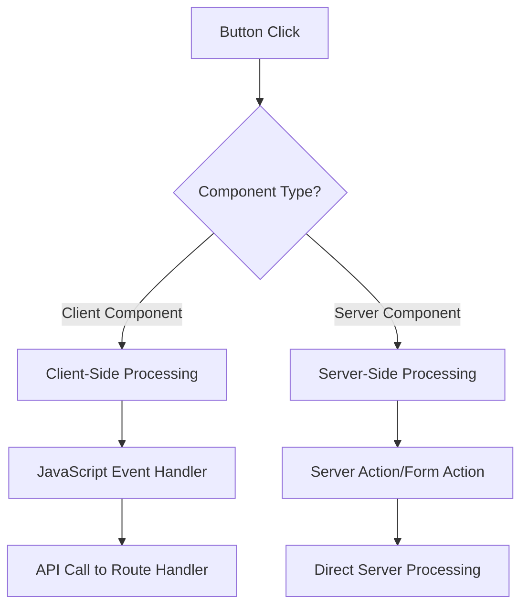
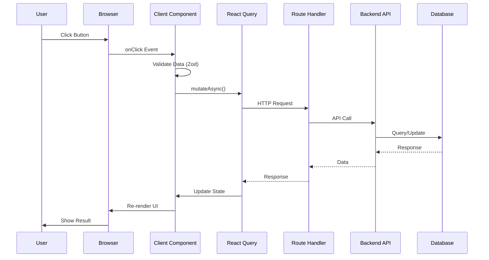

# Luồng Xử Lý Button Clicks trong NextJS - Phân Tích Chi Tiết

## 📋 Mục Lục

1. [Giới Thiệu Tổng Quan](#giới-thiệu-tổng-quan)
2. [Server Components vs Client Components](#server-components-vs-client-components)
3. [Luồng Xử Lý Button trong Client Components](#luồng-xử-lý-button-trong-client-components)
4. [Luồng Xử Lý Button trong Server Components](#luồng-xử-lý-button-trong-server-components)
5. [Server Actions vs Route Handlers](#server-actions-vs-route-handlers)
6. [Phân Tích Source Code Thực Tế](#phân-tích-source-code-thực-tế)
7. [So Sánh Chi Tiết Các Phương Pháp](#so-sánh-chi-tiết-các-phương-pháp)
8. [Best Practices và Khuyến Nghị](#best-practices-và-khuyến-nghị)

---

## 🚀 Giới Thiệu Tổng Quan

Trong NextJS App Router, việc xử lý button clicks có **2 phương pháp chính** tùy thuộc vào loại component:

### 🔍 Tại sao cần phân biệt?



**Điểm khác biệt chính:**

- 🖥️ **Server Components**: Chạy trên server, không có JavaScript interactivity
- 💻 **Client Components**: Chạy trên browser, có đầy đủ JavaScript events
- 🔄 **Hydration**: Process biến static HTML thành interactive

---

## 🧩 Server Components vs Client Components

### 🖥️ **Server Components**

#### **Đặc điểm:**

- ✅ Render trên server
- ✅ Có thể fetch data trực tiếp
- ✅ Không gửi JavaScript xuống client
- ❌ Không có event handlers (onClick, onChange, etc.)
- ❌ Không có state (useState, useEffect, etc.)
- ❌ Không có browser APIs

#### **Ví dụ trong dự án:**

```tsx
// src/app/[locale]/(public)/page.tsx - Server Component
export default async function Home() {
  // ✅ Fetch data trực tiếp trên server
  let dishList: DishListResType['data'] = []
  try {
    const result = await dishApiRequest.list()
    dishList = result.payload.data
  } catch (error) {
    return <div>Something went wrong</div>
  }

  return (
    <div className='w-full space-y-4'>
      {dishList.map((dish) => (
        <DishCard key={dish.id} dish={dish} />
      ))}
    </div>
  )
}
```

### 💻 **Client Components**

#### **Đặc điểm:**

- ✅ Render trên browser (sau hydration)
- ✅ Có đầy đủ JavaScript interactivity
- ✅ Có thể sử dụng useState, useEffect
- ✅ Có thể handle events (onClick, onSubmit, etc.)
- ✅ Có thể access browser APIs
- ❌ Cần thêm `'use client'` directive

#### **Ví dụ trong dự án:**

```tsx
// src/app/[locale]/(public)/(auth)/login/login-form.tsx - Client Component
'use client'
export default function LoginForm() {
  const loginMutation = useLoginMutation()
  const form = useForm<LoginBodyType>({
    resolver: zodResolver(LoginBody)
  })

  // ✅ Event handler - chỉ có trong client component
  const onSubmit = async (data: LoginBodyType) => {
    if (loginMutation.isPending) return
    try {
      const result = await loginMutation.mutateAsync(data)
      // Handle success...
    } catch (error) {
      // Handle error...
    }
  }

  return (
    <form onSubmit={form.handleSubmit(onSubmit)}>
      <Button type='submit'>Đăng nhập</Button>
    </form>
  )
}
```

---

## 💻 Luồng Xử Lý Button trong Client Components

### 🔄 **Luồng Hoàn Chỉnh:**



### 📝 **Ví Dụ Chi Tiết: Login Form**

#### **File:** `src/app/[locale]/(public)/(auth)/login/login-form.tsx`

```tsx
'use client'
export default function LoginForm() {
  // 1️⃣ Setup state và form
  const loginMutation = useLoginMutation()
  const form = useForm<LoginBodyType>({
    resolver: zodResolver(LoginBody),
    defaultValues: {
      email: '',
      password: ''
    }
  })

  // 2️⃣ Event handler
  const onSubmit = async (data: LoginBodyType) => {
    // 3️⃣ Prevent duplicate submissions
    if (loginMutation.isPending) return

    try {
      // 4️⃣ Call API through React Query
      const result = await loginMutation.mutateAsync(data)

      // 5️⃣ Handle success
      toast({
        description: result.payload.message
      })
      setRole(result.payload.data.account.role)
      router.push('/manage/dashboard')
      setSocket(generateSocketInstace(result.payload.data.accessToken))
    } catch (error: any) {
      // 6️⃣ Handle error
      handleErrorApi({
        error,
        setError: form.setError
      })
    }
  }

  return (
    <Form {...form}>
      <form onSubmit={form.handleSubmit(onSubmit)}>
        {/* Form fields... */}
        <Button type='submit' className='w-full'>
          {loginMutation.isPending && <LoaderCircle className='w-5 h-5 mr-2 animate-spin' />}
          Đăng nhập
        </Button>
      </form>
    </Form>
  )
}
```

### 🔄 **React Query Mutation:**

#### **File:** `src/queries/useAuth.tsx`

```tsx
export const useLoginMutation = () => {
  const queryClient = useQueryClient()

  return useMutation({
    mutationFn: (body: LoginBodyType) => authApiRequest.login(body),
    onSuccess: (data) => {
      // ✅ Invalidate related queries
      queryClient.invalidateQueries({
        queryKey: ['account']
      })
    },
    onError: (error) => {
      // ✅ Error handling
      console.error('Login failed:', error)
    }
  })
}
```

### 🌐 **Route Handler:**

#### **File:** `src/app/api/auth/login/route.ts`

```tsx
export async function POST(request: Request) {
  const body = (await request.json()) as LoginBodyType
  const cookieStore = await cookies()

  try {
    // 1️⃣ Call backend API
    const { payload } = await authApiRequest.sLogin(body)
    const { accessToken, refreshToken } = payload.data

    // 2️⃣ Set cookies
    const decodedAccessToken = jwt.decode(accessToken) as { exp: number }
    const decodedRefreshToken = jwt.decode(refreshToken) as { exp: number }

    cookieStore.set('accessToken', accessToken, {
      path: '/',
      httpOnly: true,
      sameSite: 'lax',
      secure: true,
      expires: decodedAccessToken.exp * 1000
    })

    cookieStore.set('refreshToken', refreshToken, {
      path: '/',
      httpOnly: true,
      sameSite: 'lax',
      secure: true,
      expires: decodedRefreshToken.exp * 1000
    })

    // 3️⃣ Return response
    return Response.json(payload)
  } catch (error) {
    if (error instanceof HttpError) {
      return Response.json(error.payload, {
        status: error.status
      })
    } else {
      return Response.json(
        {
          message: 'Có lỗi xảy ra'
        },
        {
          status: 500
        }
      )
    }
  }
}
```

---

## 🖥️ Luồng Xử Lý Button trong Server Components

### ⚠️ **Vấn Đề Quan Trọng:**

**Server Components KHÔNG THỂ có event handlers trực tiếp!**

```tsx
// ❌ KHÔNG THỂ làm như này trong Server Component
export default function ServerComponent() {
  const handleClick = () => {
    console.log('Clicked!') // ❌ Lỗi!
  }

  return <button onClick={handleClick}>Click me</button> // ❌ Lỗi!
}
```

### ✅ **Các Giải Pháp:**

#### **1. Server Actions (Khuyến nghị)**

```tsx
// Server Component với Server Action
export default function ServerForm() {
  // ✅ Server Action - chạy trên server
  async function handleSubmit(formData: FormData) {
    'use server'

    const name = formData.get('name') as string
    const email = formData.get('email') as string

    // Xử lý trực tiếp trên server
    await database.user.create({
      data: { name, email }
    })

    // Redirect sau khi xử lý
    redirect('/success')
  }

  return (
    <form action={handleSubmit}>
      <input name='name' type='text' required />
      <input name='email' type='email' required />
      <button type='submit'>Submit</button>
    </form>
  )
}
```

#### **2. Chuyển sang Client Component**

```tsx
// Server Component
export default function ServerPage() {
  return (
    <div>
      <h1>Server Content</h1>
      {/* Chuyển phần interactive sang Client Component */}
      <InteractiveButton />
    </div>
  )
}

// Client Component riêng biệt
;('use client')
function InteractiveButton() {
  const handleClick = () => {
    console.log('Clicked!')
  }

  return <button onClick={handleClick}>Click me</button>
}
```

### 🔄 **Server Actions trong Dự Án:**

#### **File:** `src/services/locale.ts`

```tsx
'use server'

import { cookies } from 'next/headers'
import { Locale, defaultLocale } from '@/config'

const COOKIE_NAME = 'NEXT_LOCALE'

export async function getUserLocale() {
  return (await cookies()).get(COOKIE_NAME)?.value || defaultLocale
}

export async function setUserLocale(locale: Locale) {
  ;(await cookies()).set(COOKIE_NAME, locale)
}
```

**Cách sử dụng:**

```tsx
// Client Component
'use client'
import { setUserLocale } from '@/services/locale'

export default function LanguageSwitcher() {
  const handleChangeLanguage = async (locale: Locale) => {
    // ✅ Gọi Server Action từ Client Component
    await setUserLocale(locale)
    window.location.reload()
  }

  return <button onClick={() => handleChangeLanguage('vi')}>Tiếng Việt</button>
}
```

---

## ⚔️ Server Actions vs Route Handlers

### 📊 **So Sánh Chi Tiết:**

| Tiêu Chí             | Server Actions         | Route Handlers          |
| -------------------- | ---------------------- | ----------------------- |
| **Syntax**           | `'use server'`         | `export async function` |
| **HTTP Methods**     | Chỉ POST               | GET, POST, PUT, DELETE  |
| **Form Integration** | ⭐⭐⭐⭐⭐ Native      | ⭐⭐⭐ Manual           |
| **Type Safety**      | ⭐⭐⭐⭐⭐ Excellent   | ⭐⭐⭐⭐ Good           |
| **Bundle Size**      | ⭐⭐⭐⭐⭐ Zero impact | ⭐⭐⭐ Minimal          |
| **Flexibility**      | ⭐⭐⭐ Limited         | ⭐⭐⭐⭐⭐ Full control |
| **Error Handling**   | ⭐⭐⭐ Basic           | ⭐⭐⭐⭐⭐ Complete     |
| **Authentication**   | ⭐⭐⭐⭐ Good          | ⭐⭐⭐⭐⭐ Excellent    |

### 🎯 **Khi Nào Sử Dụng:**

#### **Server Actions - Tốt cho:**

- ✅ Form submissions đơn giản
- ✅ CRUD operations cơ bản
- ✅ Cookie/session management
- ✅ File uploads nhỏ
- ✅ Validation và redirect

#### **Route Handlers - Tốt cho:**

- ✅ Complex API logic
- ✅ Multiple HTTP methods
- ✅ Authentication flows
- ✅ Third-party integrations
- ✅ Error handling phức tạp
- ✅ JSON responses

---

## 📝 Phân Tích Source Code Thực Tế

### 🔍 **1. Client Component Button - Add Order**

#### **File:** `src/app/[locale]/manage/orders/add-order.tsx`

```tsx
'use client'
export default function AddOrder() {
  const [open, setOpen] = useState(false)
  const createOrderMutation = useCreateOrderMutation()
  const createGuestMutation = useCreateGuestMutation()

  // ✅ Complex business logic trong client component
  const handleOrder = async () => {
    try {
      let guestId = selectedGuest?.id

      // 1️⃣ Create guest if needed
      if (isNewGuest) {
        const guestRes = await createGuestMutation.mutateAsync({
          name,
          tableNumber
        })
        guestId = guestRes.payload.data.id
      }

      // 2️⃣ Validation
      if (!guestId) {
        toast({
          description: 'Hãy chọn một khách hàng'
        })
        return
      }

      // 3️⃣ Create order
      await createOrderMutation.mutateAsync({
        guestId,
        orders
      })

      // 4️⃣ Reset form
      reset()
    } catch (error) {
      handleErrorApi({
        error,
        setError: form.setError
      })
    }
  }

  return (
    <Dialog>
      <DialogTrigger asChild>
        {/* ✅ Button trigger dialog */}
        <Button size='sm' className='h-7 gap-1'>
          <PlusCircle className='h-3.5 w-3.5' />
          <span>Tạo đơn hàng</span>
        </Button>
      </DialogTrigger>

      <DialogContent>
        {/* Form content... */}
        <Button onClick={handleOrder}>Đặt hàng</Button>
      </DialogContent>
    </Dialog>
  )
}
```

**Luồng xử lý:**

1. **User clicks** "Tạo đơn hàng" → Open dialog
2. **User fills form** → State updates
3. **User clicks** "Đặt hàng" → `handleOrder()` executes
4. **Business logic** → Create guest + Create order
5. **Success** → Reset form, close dialog, show toast

### 🔍 **2. Client Component Button - Menu Order**

#### **File:** `src/app/[locale]/guest/menu/menu-order.tsx`

```tsx
'use client'
export default function MenuOrder() {
  const [orders, setOrders] = useState<GuestCreateOrdersBodyType>([])
  const { mutateAsync } = useGuestOrderMutation()
  const router = useRouter()

  // ✅ Simple order submission
  const handleOrder = async () => {
    try {
      await mutateAsync(orders)
      router.push(`/guest/orders`)
    } catch (error) {
      handleErrorApi({
        error
      })
    }
  }

  return (
    <div>
      {/* Dish list with quantity controls... */}

      <Button onClick={handleOrder} className='w-full'>
        Đặt hàng • {formatCurrency(totalPrice)}
      </Button>
    </div>
  )
}
```

### 🔍 **3. Form Submission Pattern**

#### **File:** `src/app/[locale]/(public)/tables/[number]/guest-login-form.tsx`

```tsx
'use client'
export default function GuestLoginForm() {
  const loginMutation = useGuestLoginMutation()
  const form = useForm<GuestLoginBodyType>({
    resolver: zodResolver(GuestLoginBody)
  })

  // ✅ Form submission với validation
  async function onSubmit(values: GuestLoginBodyType) {
    if (loginMutation.isPending) return

    try {
      const result = await loginMutation.mutateAsync(values)
      setRole(result.payload.data.guest.role)
      setSocket(generateSocketInstace(result.payload.data.accessToken))
      router.push('/guest/menu')
    } catch (error) {
      handleErrorApi({
        error,
        setError: form.setError
      })
    }
  }

  return (
    <Form {...form}>
      <form onSubmit={form.handleSubmit(onSubmit)}>
        {/* Form fields... */}
        <Button type='submit' className='w-full'>
          Đăng nhập
        </Button>
      </form>
    </Form>
  )
}
```

### 🔍 **4. Server Component với Static Content**

#### **File:** `src/app/[locale]/(public)/page.tsx`

```tsx
// ✅ Server Component - không có button interactions
export default async function Home() {
  let dishList: DishListResType['data'] = []
  try {
    const result = await dishApiRequest.list()
    dishList = result.payload.data
  } catch (error) {
    return <div>Something went wrong</div>
  }

  return (
    <div className='w-full space-y-4'>
      {dishList.map((dish) => (
        // ✅ Static content only
        <DishCard key={dish.id} dish={dish} />
      ))}
    </div>
  )
}
```

---

## 📊 So Sánh Chi Tiết Các Phương Pháp

### **1. Performance Comparison**

| Phương Pháp          | Bundle Size | Initial Load | Interactivity | SEO        |
| -------------------- | ----------- | ------------ | ------------- | ---------- |
| **Server Component** | ⭐⭐⭐⭐⭐  | ⭐⭐⭐⭐⭐   | ❌            | ⭐⭐⭐⭐⭐ |
| **Client Component** | ⭐⭐⭐      | ⭐⭐⭐       | ⭐⭐⭐⭐⭐    | ⭐⭐⭐     |
| **Server Actions**   | ⭐⭐⭐⭐⭐  | ⭐⭐⭐⭐     | ⭐⭐⭐⭐      | ⭐⭐⭐⭐⭐ |
| **Route Handlers**   | ⭐⭐⭐⭐    | ⭐⭐⭐       | ⭐⭐⭐⭐⭐    | ⭐⭐⭐⭐   |

### **2. Use Case Recommendations**

```
Decision Framework:

1. Cần interactivity không?
   ├─ Không → Server Component (static content)
   └─ Có → Tiếp câu 2

2. Logic phức tạp không?
   ├─ Không → Server Actions (simple forms)
   └─ Có → Client Component + Route Handler

3. Cần real-time updates không?
   ├─ Có → Client Component + Socket.io
   └─ Không → Client Component + React Query

4. SEO quan trọng không?
   ├─ Có → Server Component + Client Component hybrid
   └─ Không → Pure Client Component
```

---

## 🚀 Best Practices và Khuyến Nghị

### ✅ **Do's (Nên làm)**

#### **1. Client Components:**

```tsx
// ✅ Proper error handling
const handleSubmit = async (data) => {
  if (mutation.isPending) return // Prevent double submission

  try {
    await mutation.mutateAsync(data)
    toast.success('Success!')
  } catch (error) {
    handleErrorApi({ error, setError: form.setError })
  }
}

// ✅ Loading states
<Button disabled={mutation.isPending}>
  {mutation.isPending && <Spinner />}
  Submit
</Button>

// ✅ Form validation
const form = useForm({
  resolver: zodResolver(schema), // Client-side validation
  defaultValues: {...}
})
```

#### **2. Server Components:**

```tsx
// ✅ Data fetching
export default async function ServerPage() {
  const data = await fetchData() // Direct server call

  return (
    <div>
      <StaticContent data={data} />
      <ClientInteractiveComponent />
    </div>
  )
}

// ✅ Metadata generation
export async function generateMetadata({ params }) {
  const data = await fetchData(params.id)
  return {
    title: data.title,
    description: data.description
  }
}
```

#### **3. Hybrid Approach:**

```tsx
// ✅ Server Component wrapper
export default async function HybridPage() {
  const staticData = await fetchStaticData()

  return (
    <div>
      {/* Server-rendered static content */}
      <StaticSection data={staticData} />

      {/* Client-rendered interactive content */}
      <InteractiveSection />
    </div>
  )
}

// ✅ Client Component for interactions
;('use client')
function InteractiveSection() {
  // Interactive logic here
}
```

### ❌ **Don'ts (Không nên làm)**

#### **1. Tránh các lỗi thường gặp:**

```tsx
// ❌ Event handlers trong Server Component
export default function ServerComponent() {
  const handleClick = () => {} // ❌ Lỗi!
  return <button onClick={handleClick}>Click</button>
}

// ❌ useState trong Server Component
export default function ServerComponent() {
  const [state, setState] = useState(false) // ❌ Lỗi!
  return <div>{state}</div>
}

// ❌ useEffect trong Server Component
export default function ServerComponent() {
  useEffect(() => {}, []) // ❌ Lỗi!
  return <div>Content</div>
}

// ❌ Browser APIs trong Server Component
export default function ServerComponent() {
  const data = localStorage.getItem('data') // ❌ Lỗi!
  return <div>{data}</div>
}
```

#### **2. Performance anti-patterns:**

```tsx
// ❌ Không cache expensive operations
const ExpensiveComponent = () => {
  const expensiveValue = expensiveCalculation() // Tính lại mỗi render
  return <div>{expensiveValue}</div>
}

// ✅ Cache với useMemo
const ExpensiveComponent = () => {
  const expensiveValue = useMemo(() => expensiveCalculation(), [deps])
  return <div>{expensiveValue}</div>
}

// ❌ Không handle loading states
const BadButton = () => {
  const handleClick = async () => {
    await apiCall() // Không feedback cho user
  }
  return <button onClick={handleClick}>Submit</button>
}

// ✅ Proper loading states
const GoodButton = () => {
  const [loading, setLoading] = useState(false)

  const handleClick = async () => {
    setLoading(true)
    try {
      await apiCall()
    } finally {
      setLoading(false)
    }
  }

  return (
    <button disabled={loading} onClick={handleClick}>
      {loading ? <Spinner /> : 'Submit'}
    </button>
  )
}
```

### 🎯 **Optimization Tips**

#### **1. Bundle Size Optimization:**

```tsx
// ✅ Dynamic imports cho heavy components
const HeavyChart = dynamic(() => import('./HeavyChart'), {
  loading: () => <ChartSkeleton />,
  ssr: false // Nếu không cần SSR
})

// ✅ Code splitting cho dialogs
const EditDialog = dynamic(() => import('./EditDialog'))

// ✅ Conditional loading
const ConditionalComponent = ({ showChart }) => {
  return <div>{showChart && <HeavyChart />}</div>
}
```

#### **2. State Management:**

```tsx
// ✅ Local state cho UI logic
const [open, setOpen] = useState(false)

// ✅ Global state cho shared data
const user = useAppStore((state) => state.user)

// ✅ Server state cho API data
const { data } = useQuery({
  queryKey: ['dishes'],
  queryFn: fetchDishes
})
```

---

## 🎯 Kết Luận

### **Tóm Tắt Luồng Xử Lý:**

#### **1. Client Component Button Flow:**

```
User Click → Event Handler → Validation → API Call →
State Update → UI Re-render → User Feedback
```

#### **2. Server Component Button Flow:**

```
User Submit → Server Action → Server Processing →
Database Update → Redirect/Response
```

#### **3. Hybrid Flow:**

```
Server Render → Hydration → Client Interaction →
API Call → State Update → UI Update
```

### **Key Takeaways:**

1. **Server Components**: Tốt cho static content, SEO, performance
2. **Client Components**: Cần thiết cho interactivity, user input
3. **Server Actions**: Đơn giản cho forms, CRUD operations
4. **Route Handlers**: Linh hoạt cho complex API logic
5. **Hybrid Approach**: Tối ưu nhất cho most use cases

### **Dự Án POS App sử dụng:**

- ✅ **Client Components** cho tất cả interactive features
- ✅ **Server Components** cho static content pages
- ✅ **Route Handlers** cho authentication và API proxy
- ✅ **React Query** cho state management và caching
- ✅ **Proper error handling** và loading states

**Kết luận cuối:** Dự án đã implement đúng patterns và best practices cho NextJS App Router, tận dụng tối đa ưu điểm của cả server và client rendering.

---

**Tác giả**: AI Assistant  
**Dựa trên**: Phân tích chi tiết NextJS Super PosApp source code  
**Ngày**: 2024
