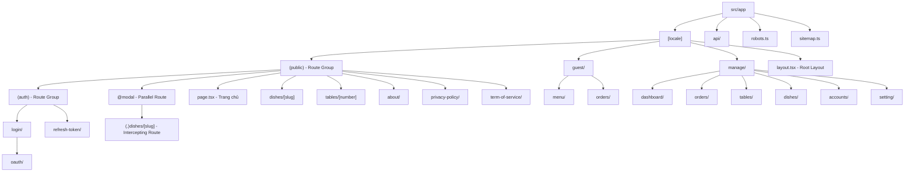
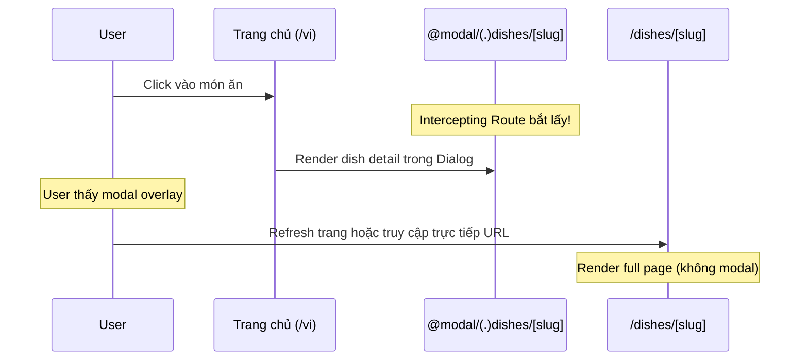
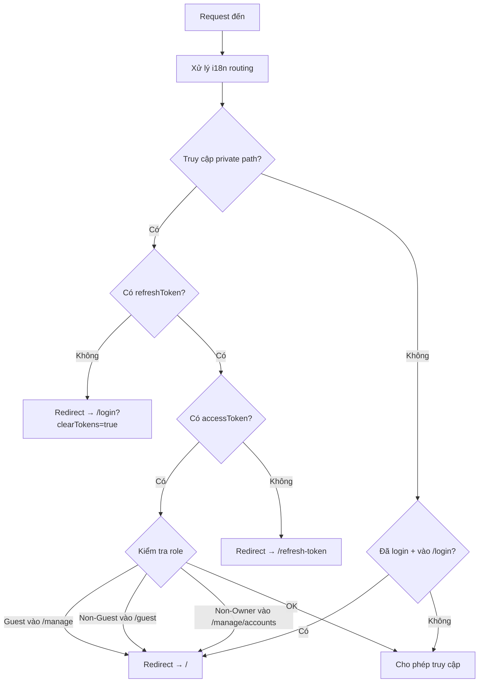

# Phân Tích Routing & Rendering Strategy - NextJS POS App

> **Dự án:** NextJS Super POS App
> **Next.js version:** 15.0.2
> **Ngày phân tích:** 2026-02-28

---

## Mục Lục

1. [Tổng Quan Cấu Trúc Routing](#1-tổng-quan-cấu-trúc-routing)
2. [Chi Tiết Từng Route](#2-chi-tiết-từng-route)
3. [Route Groups, Parallel Routes & Intercepting Routes](#3-route-groups-parallel-routes--intercepting-routes)
4. [Static vs Dynamic Rendering & SEO](#4-static-vs-dynamic-rendering--seo)
5. [Dynamic Functions & Rendering Mode](#5-dynamic-functions--rendering-mode)
6. [Middleware & Authentication](#6-middleware--authentication)
7. [API Routes](#7-api-routes)
8. [Next.js 16 - Tính Năng Mới](#8-nextjs-16---tính-năng-mới)

---

## 1. Tổng Quan Cấu Trúc Routing

### Sơ đồ tổng thể (Mermaid)



### Internationalization (i18n)

Dự án sử dụng `next-intl` với 2 locale:
- `vi` (Tiếng Việt) - **default**
- `en` (English)

Mọi route đều nằm trong `[locale]`, nghĩa là URL luôn có dạng:
- `https://domain.com/vi/...`
- `https://domain.com/en/...`

**File cấu hình:** `src/i18n/routing.ts`
```typescript
export const routing = defineRouting({
  locales: ['en', 'vi'],
  defaultLocale: 'vi'
})
```

**Static Params cho locale:** Trong `layout.tsx` root có `generateStaticParams()` để pre-render cả 2 locale:
```typescript
export function generateStaticParams() {
  return routing.locales.map((locale) => ({ locale }))
}
```

---

## 2. Chi Tiết Từng Route

### 2.1. Root Layout (`/[locale]/layout.tsx`)

| Thuộc tính | Giá trị |
|---|---|
| **Loại** | Server Component (async) |
| **Rendering** | Dynamic (do `getMessages()`, `setRequestLocale()`) |
| **Chức năng** | Layout gốc cho toàn bộ app |

**Bao gồm:**
- Font loading (Inter)
- Theme Provider (dark/light mode)
- NextIntlClientProvider (i18n messages)
- AppProvider (global state - Zustand)
- NextTopLoader (progress bar)
- Footer
- Google Tag (analytics)
- Toaster (notifications)

**Metadata:** Template-based title `%s | Brand Name`

### 2.2. Public Routes (`/(public)/...`)

#### Trang chủ - `/(public)/page.tsx`
| Thuộc tính | Giá trị |
|---|---|
| **URL** | `/vi` hoặc `/en` |
| **Rendering** | Dynamic (fetch dish list từ API) |
| **SEO** | ✅ `generateMetadata()` với title, description, canonical URL |
| **Chức năng** | Hiển thị banner + danh sách món ăn |

#### Chi tiết món ăn - `/(public)/dishes/[slug]/page.tsx`
| Thuộc tính | Giá trị |
|---|---|
| **URL** | `/vi/dishes/mon-an-1-i.123` |
| **Dynamic Param** | `[slug]` - slug URL chứa tên + id |
| **Rendering** | Dynamic (fetch dish detail từ API, dùng `cache()`) |
| **SEO** | ✅ Full OpenGraph metadata, canonical URL, hình ảnh |

#### Đăng nhập bàn - `/(public)/tables/[number]/page.tsx`
| Thuộc tính | Giá trị |
|---|---|
| **URL** | `/vi/tables/1?token=xxx` |
| **Dynamic Param** | `[number]` - số bàn |
| **Rendering** | Dynamic (dùng `searchParams`) |
| **SEO** | `robots: { index: false }` - Không index |

#### Login - `/(public)/(auth)/login/page.tsx`
| Thuộc tính | Giá trị |
|---|---|
| **URL** | `/vi/login` |
| **Rendering** | Dynamic (`setRequestLocale()`) |
| **SEO** | ✅ Title, description, canonical URL |

#### OAuth - `/(public)/(auth)/login/oauth/page.tsx`
| Thuộc tính | Giá trị |
|---|---|

#### About - `/(public)/about/page.tsx`
| Thuộc tính | Giá trị |
|---|---|
| **URL** | `/vi/about` |
| **Rendering** | Static (không có dynamic function nào) |
| **SEO** | Không có `generateMetadata()` - dùng default từ layout |

#### Privacy Policy - `/(public)/privacy-policy/page.tsx`
| Thuộc tính | Giá trị |
|---|---|
| **URL** | `/vi/privacy-policy` |
| **Rendering** | Static |
| **SEO** | Không có `generateMetadata()` |

#### Terms of Service - `/(public)/term-of-service/page.tsx`
| Thuộc tính | Giá trị |
|---|---|
| **URL** | `/vi/term-of-service` |
| **Rendering** | Static |
| **SEO** | Không có `generateMetadata()` |

### 2.3. Guest Routes (`/guest/...`)

> **Yêu cầu:** Phải đăng nhập với role `Guest` (qua QR code tại bàn)

#### Menu - `/guest/menu/page.tsx`
| Thuộc tính | Giá trị |
|---|---|
| **URL** | `/vi/guest/menu` |
| **Rendering** | Dynamic (`generateMetadata()` với `getTranslations()`) |
| **SEO** | `robots: { index: false }` |
| **Chức năng** | Hiển thị menu để khách gọi món |

#### Orders - `/guest/orders/page.tsx`
| Thuộc tính | Giá trị |
|---|---|
| **URL** | `/vi/guest/orders` |
| **Rendering** | Static (không có dynamic function) |
| **Chức năng** | Hiển thị đơn hàng của khách |

**Lưu ý:** Guest layout reuse layout của `(public)` nhưng truyền `modal={null}`:
```typescript
// src/app/[locale]/guest/layout.tsx
export default function GuestLayout({ children }) {
  return (
    <Layout modal={null} params={Promise.resolve({ locale: defaultLocale })}>
      {children}
    </Layout>
  )
}
```

### 2.4. Manage Routes (`/manage/...`)

> **Yêu cầu:** Phải đăng nhập với role `Owner` hoặc `Employee`

#### Dashboard - `/manage/dashboard/page.tsx`
| Thuộc tính | Giá trị |
|---|---|
| **URL** | `/vi/manage/dashboard` |
| **Rendering** | Dynamic (`generateMetadata()`) |
| **SEO** | `robots: { index: false }` |
| **Đặc biệt** | Dùng `next/dynamic` để lazy load `DashboardMain` |

#### Orders - `/manage/orders/page.tsx`
| Thuộc tính | Giá trị |
|---|---|
| **URL** | `/vi/manage/orders` |
| **Rendering** | Dynamic |
| **SEO** | `robots: { index: false }` |
| **Đặc biệt** | Dùng `next/dynamic` cho `AddOrder` component |

#### Tables - `/manage/tables/page.tsx`
| Thuộc tính | Giá trị |
|---|---|
| **URL** | `/vi/manage/tables` |
| **Rendering** | Dynamic |
| **SEO** | `robots: { index: false }` |

#### Dishes - `/manage/dishes/page.tsx`
| Thuộc tính | Giá trị |
|---|---|
| **URL** | `/vi/manage/dishes` |
| **Rendering** | Dynamic |
| **SEO** | `robots: { index: false }` |

#### Accounts - `/manage/accounts/page.tsx`
| Thuộc tính | Giá trị |
|---|---|
| **URL** | `/vi/manage/accounts` |
| **Rendering** | **Dynamic (dùng `cookies()`)** |
| **SEO** | `robots: { index: false }` |
| **Quyền** | Chỉ `Owner` mới truy cập được |

#### Setting - `/manage/setting/page.tsx`
| Thuộc tính | Giá trị |
|---|---|
| **URL** | `/vi/manage/setting` |
| **Rendering** | Dynamic |
| **SEO** | `robots: { index: false }` |

---

## 3. Route Groups, Parallel Routes & Intercepting Routes

### 3.1. Route Groups

Route Group là folder có tên bọc trong `()`. Chúng **KHÔNG** tạo ra segment trong URL, chỉ dùng để tổ chức code.

```
src/app/[locale]/(public)/...     → URL: /vi/...        (không có "/public/" trong URL)
src/app/[locale]/(public)/(auth)/ → URL: /vi/...        (không có "/public/auth/" trong URL)
```

**Dự án có 2 route groups:**

#### `(public)` - Nhóm trang công khai
- Chứa tất cả trang mà ai cũng truy cập được (trang chủ, dishes, about, login...)
- Có **layout riêng** với header navigation, dark mode toggle, switch language
- Nhận prop `modal` cho parallel route

#### `(auth)` - Nhóm trang xác thực
- Nằm bên trong `(public)`
- Chứa: `login/`, `refresh-token/`
- **Không có layout riêng** → kế thừa layout từ `(public)`

### 3.2. Parallel Routes (`@modal`)

```
src/app/[locale]/(public)/@modal/
├── default.tsx          → return null (khi không có modal)
└── (.)dishes/[slug]/
    ├── modal.tsx        → Dialog wrapper (client component)
    └── page.tsx         → Fetch dish detail + render trong modal
```

**Cách hoạt động:**

Parallel Route cho phép render **đồng thời** nhiều page trong cùng một layout. Trong dự án này:

1. Layout `(public)` nhận 2 props: `children` và `modal`
```typescript
export default async function Layout(props: {
  children: React.ReactNode
  modal: React.ReactNode    // ← Parallel route slot
}) {
  return (
    <main>
      {children}
      {modal}    {/* ← Render modal song song với children */}
    </main>
  )
}
```

2. `default.tsx` trả về `null` → khi không navigate vào dish detail, modal slot trống
3. Khi user click vào món ăn từ trang chủ → intercepting route bắt lấy và render modal

### 3.3. Intercepting Routes (`(.)dishes`)

```
@modal/(.)dishes/[slug]/page.tsx
```

**Ký hiệu `(.)`** nghĩa là intercept route **cùng cấp** (same level). Cụ thể:
- `(.)` = cùng cấp (match `dishes/[slug]` cùng level với `@modal`)
- `(..)` = lên 1 cấp
- `(...)` = từ root

**Flow hoạt động:**



**Tóm lại:**
- **Soft navigation** (click link): Hiển thị dish detail trong **modal dialog**
- **Hard navigation** (refresh/direct URL): Hiển thị dish detail **full page**

---

## 4. Static vs Dynamic Rendering & SEO

### 4.1. Khái niệm

| | Static Rendering (SSG/ISR) | Dynamic Rendering (SSR) |
|---|---|---|
| **Khi nào render** | Build time (hoặc revalidate) | Mỗi request |
| **TTFB** | Rất nhanh (serve từ CDN) | Chậm hơn (phải chạy server) |
| **Phù hợp** | Nội dung ít thay đổi | Nội dung cá nhân hóa, real-time |
| **SEO** | Tốt nhất (nhanh, crawlable) | Tốt (nhưng TTFB cao hơn) |

### 4.2. Tại sao Static Rendering tốt hơn cho SEO?

1. **TTFB (Time to First Byte) thấp hơn:** HTML đã được pre-render, serve trực tiếp từ CDN → Google bot nhận response nhanh hơn
2. **Core Web Vitals tốt hơn:**
   - LCP (Largest Contentful Paint) thấp hơn vì HTML sẵn sàng
   - FID/INP tốt hơn vì ít JavaScript cần execute
3. **Crawlability:** Google bot có thể đọc HTML ngay lập tức, không cần đợi JavaScript render
4. **Cache-friendly:** CDN cache static pages → consistent performance

### 4.3. Bảng phân tích rendering trong dự án

| Route | Rendering | Lý do | SEO Index? |
|---|---|---|---|
| `/` (Trang chủ) | Dynamic | Fetch dish list từ API | ✅ Có |
| `/dishes/[slug]` | Dynamic | Fetch dish detail, `params` | ✅ Có |
| `/login` | Dynamic | `setRequestLocale()` | ✅ Có |
| `/about` | Static | Không có dynamic function | ✅ Có |
| `/privacy-policy` | Static | Không có dynamic function | ✅ Có |
| `/term-of-service` | Static | Không có dynamic function | ✅ Có |
| `/tables/[number]` | Dynamic | `searchParams`, `params` | ❌ `noindex` |
| `/login/oauth` | Static | Client component only | ❌ `noindex` |
| `/refresh-token` | Static | Client component only | ❌ `noindex` |
| `/guest/*` | Dynamic | Protected route | ❌ `noindex` |
| `/manage/*` | Dynamic | Protected route, `cookies()` | ❌ `noindex` |

### 4.4. Đề xuất cải thiện SEO

1. **Trang chủ (`/`):** Có thể dùng ISR (Incremental Static Regeneration) với `revalidate` để pre-render danh sách món ăn, giảm TTFB
2. **Dish detail (`/dishes/[slug]`):** Có thể dùng `generateStaticParams()` để pre-render các món ăn phổ biến + ISR cho các món mới
3. **About, Privacy, Terms:** Đã static → tốt rồi ✅
4. **Thêm `generateMetadata()`** cho `/about`, `/privacy-policy`, `/term-of-service` để có title/description riêng

---

## 5. Dynamic Functions & Rendering Mode

### 5.1. Các Dynamic Functions trong Next.js

Khi một Server Component sử dụng bất kỳ dynamic function nào dưới đây, Next.js sẽ **tự động chuyển** route đó sang **Dynamic Rendering** (render mỗi request thay vì build time):

| Dynamic Function | Mô tả | Ví dụ trong dự án |
|---|---|---|
| `cookies()` | Đọc cookies từ request | `manage/accounts/page.tsx` |
| `headers()` | Đọc headers từ request | Không sử dụng trực tiếp |
| `searchParams` | Đọc query params | `tables/[number]/page.tsx` |
| `useSearchParams()` | Client-side query params | `login/logout.tsx`, `refresh-token.tsx` |
| Dynamic `params` | Params không có `generateStaticParams()` | `dishes/[slug]`, `tables/[number]` |
| `fetch()` không cache | Fetch data mỗi request | `(public)/page.tsx` |

### 5.2. Ví dụ cụ thể từ codebase

#### Ví dụ 1: `cookies()` → Dynamic Rendering
```typescript
// src/app/[locale]/manage/accounts/page.tsx
import { cookies } from 'next/headers'

export default async function AccountsPage() {
  const cookieStore = await cookies()  // ← Dynamic function!
  // → Route này LUÔN render dynamic
}
```

#### Ví dụ 2: `searchParams` prop → Dynamic Rendering
```typescript
// src/app/[locale]/(public)/tables/[number]/page.tsx
type Props = {
  params: Promise<{ number: string; locale: Locale }>
  searchParams: Promise<{ [key: string]: string | string[] | undefined }>
  // ↑ Khai báo searchParams → Next.js đánh dấu dynamic
}
```

#### Ví dụ 3: Fetch data không cache → Dynamic Rendering
```typescript
// src/app/[locale]/(public)/page.tsx
export default async function Home() {
  const result = await dishApiRequest.list()
  // ↑ Fetch data mỗi request → dynamic rendering
}
```

### 5.3. Cách opt-out khỏi Dynamic Rendering

Nếu muốn force static rendering, có thể dùng:

```typescript
// Cách 1: Export revalidate time (ISR)
export const revalidate = 3600 // Revalidate mỗi 1 giờ

// Cách 2: generateStaticParams() cho dynamic routes
export async function generateStaticParams() {
  const dishes = await dishApiRequest.list()
  return dishes.payload.data.map((dish) => ({
    slug: generateSlugUrl({ name: dish.name, id: dish.id })
  }))
}

// Cách 3: Force static
export const dynamic = 'force-static'

// Cách 4: Cache fetch requests
const data = await fetch(url, { next: { revalidate: 3600 } })
```

### 5.4. `useSearchParams()` - Trường hợp đặc biệt

`useSearchParams()` là **client-side hook**, nên nó **KHÔNG** trực tiếp làm Server Component thành dynamic. Tuy nhiên, nó cần được wrap trong `<Suspense>` để tránh lỗi:

```typescript
// src/app/[locale]/(public)/(auth)/refresh-token/page.tsx
export default function RefreshTokenPage() {
  return (
    <Suspense fallback={<div>Loading...</div>}>
      <RefreshToken />  {/* ← Component dùng useSearchParams() */}
    </Suspense>
  )
}
```

---

## 6. Middleware & Authentication

### 6.1. Middleware (`src/middleware.ts`)

Middleware chạy **trước mỗi request** và xử lý:

1. **i18n routing** (next-intl): Tự động redirect/rewrite URL theo locale
2. **Authentication & Authorization**: Kiểm tra token và role

**Matcher pattern:**
```typescript
export const config = {
  matcher: ['/', '/(vi|en)/:path*']
}
```

### 6.2. Flow xác thực



### 6.3. Phân quyền theo Role

| Path | Guest | Employee | Owner | Chưa đăng nhập |
|---|---|---|---|---|
| `/` (trang chủ) | ✅ | ✅ | ✅ | ✅ |
| `/dishes/[slug]` | ✅ | ✅ | ✅ | ✅ |
| `/login` | ❌ (redirect /) | ❌ (redirect /) | ❌ (redirect /) | ✅ |
| `/guest/menu` | ✅ | ❌ (redirect /) | ❌ (redirect /) | ❌ (redirect /login) |
| `/guest/orders` | ✅ | ❌ | ❌ | ❌ |
| `/manage/dashboard` | ❌ (redirect /) | ✅ | ✅ | ❌ |
| `/manage/orders` | ❌ | ✅ | ✅ | ❌ |
| `/manage/accounts` | ❌ | ❌ (redirect /) | ✅ | ❌ |
| `/manage/setting` | ❌ | ✅ | ✅ | ❌ |

---

## 7. API Routes

### 7.1. Cấu trúc

```
src/app/api/
├── auth/
│   ├── login/route.ts          POST - Đăng nhập Owner/Employee
│   ├── logout/route.ts         POST - Đăng xuất
│   ├── refresh-token/route.ts  POST - Refresh token
│   └── token/                  GET/POST - Token management
├── guest/
│   └── auth/
│       ├── login/route.ts      POST - Đăng nhập Guest (qua QR)
│       ├── logout/route.ts     POST - Đăng xuất Guest
│       └── refresh-token/route.ts POST - Refresh token Guest
├── accounts/
│   └── change-password-v2/     PUT - Đổi mật khẩu
└── revalidate/
    └── route.ts                POST - Revalidate cache
```

### 7.2. Pattern chung của API Routes

Tất cả API route đều sử dụng `cookies()` → **luôn Dynamic Rendering**:

```typescript
// Pattern: Proxy API call + set cookies
export async function POST(request: Request) {
  const body = await request.json()
  const cookieStore = await cookies()  // ← Dynamic!
  const { payload } = await authApiRequest.sLogin(body)
  const { accessToken, refreshToken } = payload.data

  // Set httpOnly cookies (không thể đọc từ JavaScript)
  cookieStore.set('accessToken', accessToken, {
    path: '/',
    httpOnly: true,
    sameSite: 'lax',
    secure: true,
    expires: decodedAccessToken.exp * 1000
  })
  return Response.json(payload)
}
```

**Tại sao cần API Route làm proxy?**
- Token được lưu trong **httpOnly cookies** → an toàn hơn localStorage
- Client gọi Next.js API route → Next.js API route gọi backend thật
- Tránh expose backend URL trực tiếp cho client

---

## 8. Next.js 16 - Tính Năng Mới

> **Dự án hiện tại:** Next.js **15.0.2**
> **Next.js 16:** Phát hành chính thức ngày **21/10/2025**

### 8.1. Các tính năng nổi bật của Next.js 16

#### 🚀 Turbopack (Stable & Default)
- Turbopack giờ là **bundler mặc định** cho cả `dev` và `build`
- **2-5× nhanh hơn** production builds
- **Lên đến 10× nhanh hơn** Fast Refresh
- Dự án hiện tại đã dùng `--turbopack` cho dev, nhưng chưa phải default

#### 💾 Turbopack File System Caching (Beta)
- Lưu compiler artifacts trên disk
- Compile time khi restart nhanh hơn đáng kể:
  - react.dev: ~10× nhanh hơn (3.7s → 380ms)
  - nextjs.org: ~5× nhanh hơn (3.5s → 700ms)

#### 🧩 Cache Components (thay thế PPR experimental)
- Mô hình caching mới với directive `"use cache"`
- **Opt-in caching** (không còn implicit caching như Next.js 14)
- Có thể cache pages, components, và functions riêng lẻ
- Compiler tự động generate cache keys

```typescript
// Ví dụ: Cache một component
"use cache"
export default async function DishList() {
  const dishes = await dishApiRequest.list()
  return <div>{/* render dishes */}</div>
}
```

#### 🔄 `proxy.ts` (thay thế `middleware.ts`)
- `middleware.ts` được đổi tên thành `proxy.ts`
- Chạy trên **Node.js runtime** (không còn Edge runtime)
- Rõ ràng hơn về network boundary
- `middleware.ts` vẫn hoạt động nhưng **deprecated**

#### ⚛️ React Compiler (Stable)
- Tự động memoization, không cần `useMemo`, `useCallback`, `React.memo`
- Bật với: `reactCompiler: true` trong next.config

#### 🎨 React 19.2 Features
- **View Transitions**: Animate elements khi navigation
- **useEffectEvent**: Tách non-reactive logic khỏi Effects
- **Activity**: Render background activity với `display: none`

#### 🤖 Next.js DevTools MCP
- Tích hợp Model Context Protocol cho AI-assisted debugging
- AI agents có thể hiểu context của Next.js app

#### 📦 Caching APIs mới
- **`updateTag()`**: Server Actions-only, read-your-writes semantics
- **`refresh()`**: Refresh uncached data only
- **`revalidateTag(tag, profile)`**: Cần thêm cache profile argument

### 8.2. Breaking Changes khi upgrade lên Next.js 16

| Thay đổi | Ảnh hưởng đến dự án |
|---|---|
| Node.js 20.9+ bắt buộc | Cần kiểm tra Node version |
| Turbopack là default | Dự án đã dùng `--turbopack` → ít ảnh hưởng |
| `middleware.ts` → `proxy.ts` | ⚠️ Cần rename file middleware |
| Parallel routes cần `default.js` | ✅ Dự án đã có `default.tsx` |
| AMP support bị xóa | Không ảnh hưởng (không dùng AMP) |
| `next lint` bị xóa | Cần dùng ESLint trực tiếp |
| `experimental.ppr` bị xóa | Không ảnh hưởng |
| Async request APIs bắt buộc | ✅ Dự án đã dùng `await params`, `await cookies()` |

### 8.3. Có nên upgrade lên Next.js 16?

**Đánh giá:**

| Tiêu chí | Điểm |
|---|---|
| Performance (Turbopack stable) | ⭐⭐⭐⭐⭐ |
| Cache Components (`"use cache"`) | ⭐⭐⭐⭐ |
| React Compiler (auto memo) | ⭐⭐⭐⭐ |
| Breaking changes ít | ⭐⭐⭐⭐ |
| Ecosystem compatibility | ⭐⭐⭐ |

**Khuyến nghị: NÊN upgrade**, vì:
1. Dự án đã sẵn sàng (async APIs, default.tsx cho parallel routes)
2. Turbopack stable sẽ cải thiện DX đáng kể
3. Cache Components giúp kiểm soát caching tốt hơn
4. React Compiler giảm boilerplate code
5. Chỉ cần rename `middleware.ts` → `proxy.ts` và cập nhật Node.js

**Lệnh upgrade:**
```bash
npx @next/codemod@canary upgrade latest
# hoặc manual:
npm install next@latest react@latest react-dom@latest
```

---

## Phụ Lục: SEO Files

### `robots.ts`
```typescript
// src/app/robots.ts - Cho phép tất cả bot crawl
export default function robots(): MetadataRoute.Robots {
  return {
    rules: { userAgent: '*', allow: '/' },
    sitemap: `${envConfig.NEXT_PUBLIC_URL}/sitemap.xml`
  }
}
```

### `sitemap.ts`
```typescript
// src/app/sitemap.ts - Dynamic sitemap
// Bao gồm: static routes (/, /login) + dynamic routes (dishes)
// Localized cho cả vi và en
```

### `shared-metadata.ts`
```typescript
// Base OpenGraph config dùng chung
export const baseOpenGraph = {
  locale: 'en_US',
  alternateLocale: ['vi_VN'],
  type: 'website',
  siteName: 'Bigboy Restaurant',
  images: [{ url: `${envConfig.NEXT_PUBLIC_URL}/banner.png` }]
}
```

---

> **Tài liệu này được tạo tự động dựa trên phân tích source code thực tế của dự án NextJS Super POS App v15.0.2**