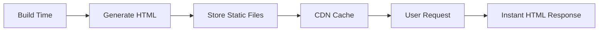
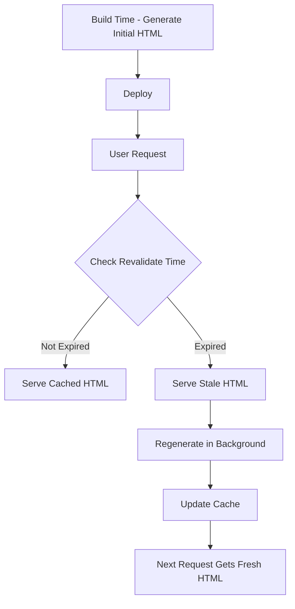

# SSR vs SSG trong NextJS - Hướng Dẫn Chi Tiết (Cập nhật Next.js 16)

## 📋 Mục Lục

1. [Giới Thiệu Tổng Quan](#giới-thiệu-tổng-quan)
2. [Static Site Generation (SSG)](#static-site-generation-ssg)
3. [Server-Side Rendering (SSR)](#server-side-rendering-ssr)
4. [So Sánh Chi Tiết SSR vs SSG](#so-sánh-chi-tiết-ssr-vs-ssg)
5. [Phân Tích Source Code Thực Tế](#phân-tích-source-code-thực-tế)
6. [Khi Nào Sử Dụng SSR vs SSG](#khi-nào-sử-dụng-ssr-vs-ssg)
7. [Incremental Static Regeneration (ISR)](#incremental-static-regeneration-isr)
8. [Cache Components (Next.js 16)](#cache-components-nextjs-16)
9. [Kết Luận và Best Practices](#kết-luận-và-best-practices)

> **Lưu ý**: Tài liệu này sử dụng **App Router** (Next.js 13+). Các API Pages Router như `getStaticProps`, `getServerSideProps`, `getStaticPaths` chỉ hoạt động trong thư mục `pages/` và không được sử dụng trong App Router.

---

## 🚀 Giới Thiệu Tổng Quan

NextJS hỗ trợ **2 phương pháp pre-rendering chính**:

### 🔍 Pre-rendering là gì?

- **Pre-rendering** có nghĩa là HTML được tạo ra **trước khi** được gửi đến browser
- Khác với Client-Side Rendering (CSR) - nơi browser phải download JavaScript trước rồi mới render HTML
- NextJS **mặc định pre-render tất cả pages** để tối ưu SEO và performance

### 🎯 2 Phương Pháp Pre-rendering

1. **Static Site Generation (SSG)** - Tạo HTML tại **build time**
2. **Server-Side Rendering (SSR)** - Tạo HTML tại **request time**

---

## 📦 Static Site Generation (SSG)

### 🔧 Cách Hoạt Động


```mermaid
graph LR
    A[Build Time] --> B[Generate HTML]
    B --> C[Store Static Files]
    C --> D[CDN Cache]
    D --> E[User Request]
    E --> F[Instant HTML Response]
```

**SSG tạo HTML tại build time và tái sử dụng cho mọi request.**

### 🛠️ Cách Implement (App Router)

#### 1. SSG Không Cần Data

```tsx
// app/about/page.tsx — Server Component (mặc định)
export default function About() {
  return (
    <div>
      <h1>About Us</h1>
      <p>This page is statically generated!</p>
    </div>
  )
}
// Tự động được pre-render tại build time vì không có dynamic API nào được gọi
```

#### 2. SSG Với Data — async Server Component

```tsx
// app/products/page.tsx — Server Component
interface Product {
  id: number
  name: string
  price: number
}

export default async function Products() {
  // Fetch data tại build time (mặc định cache: 'force-cache')
  const res = await fetch('https://api.example.com/products', {
    cache: 'force-cache' // SSG — cache vĩnh viễn cho đến khi rebuild
  })
  const products: Product[] = await res.json()

  return (
    <div>
      <h1>Sản Phẩm</h1>
      {products.map((product) => (
        <div key={product.id}>
          <h2>{product.name}</h2>
          <p>Giá: {product.price}đ</p>
        </div>
      ))}
    </div>
  )
}
```

#### 3. SSG Với Dynamic Routes — `generateStaticParams`

```tsx
// app/products/[id]/page.tsx — Server Component
interface Product {
  id: string
  name: string
  description: string
}

// Tạo danh sách params cần pre-render tại build time
export async function generateStaticParams() {
  const res = await fetch('https://api.example.com/products')
  const products: Product[] = await res.json()

  return products.map((product) => ({
    id: product.id
  }))
}

export default async function ProductDetail({
  params
}: {
  params: Promise<{ id: string }>
}) {
  const { id } = await params
  const res = await fetch(`https://api.example.com/products/${id}`)
  const product: Product = await res.json()

  return (
    <div>
      <h1>{product.name}</h1>
      <p>{product.description}</p>
    </div>
  )
}
```

### 🎯 Ưu Điểm của SSG

- ⚡ **Performance tuyệt vời**: HTML đã sẵn sàng, load cực nhanh
- 🌐 **CDN-friendly**: Có thể cache toàn cầu
- 💰 **Chi phí thấp**: Ít server resources
- 🔍 **SEO tối ưu**: HTML có sẵn ngay lập tức
- 📱 **Mobile-friendly**: Ít JavaScript bundle

### ⚠️ Nhược Điểm của SSG

- 🕐 **Data có thể cũ**: Vì được generate tại build time
- ⏳ **Build time dài**: Nếu có nhiều pages
- 🔄 **Update khó khăn**: Cần rebuild để update content

---

## 🖥️ Server-Side Rendering (SSR)

### 🔧 Cách Hoạt Động


```mermaid
graph LR
    A[User Request] --> B[Server]
    B --> C[Fetch Fresh Data]
    C --> D[Generate HTML]
    D --> E[Send HTML to Browser]
    E --> F[Hydration]
```

**SSR tạo HTML mới cho mỗi request.**

### 🛠️ Cách Implement (App Router)

#### Server Component với dynamic data

```tsx
// app/dashboard/page.tsx — Server Component
import { cookies, headers } from 'next/headers'

interface User {
  id: number
  name: string
  email: string
}

export default async function Dashboard() {
  const cookieStore = await cookies()
  const userToken = cookieStore.get('authToken')?.value

  // Fetch fresh data cho mỗi request
  const userRes = await fetch('https://api.example.com/user', {
    headers: {
      Authorization: `Bearer ${userToken}`
    },
    cache: 'no-store' // SSR — không cache, luôn fetch mới
  })
  const user: User = await userRes.json()

  return (
    <div>
      <h1>Dashboard - {user.name}</h1>
      <p>Email: {user.email}</p>
      <p>Thời gian hiện tại: {new Date().toISOString()}</p>
    </div>
  )
}
```

> **Lưu ý**: Trong App Router, một page trở thành SSR (dynamic) khi sử dụng:
> - `cookies()`, `headers()`, `searchParams`
> - `fetch()` với `cache: 'no-store'`
> - `export const dynamic = 'force-dynamic'`

### 🎯 Ưu Điểm của SSR

- 🔄 **Data luôn fresh**: Fetch data mới cho mỗi request
- 👤 **Personalization**: Có thể customize theo user
- 🔐 **Security**: Có thể access cookies, session
- 🔍 **SEO tốt**: HTML có sẵn ngay (nhưng chậm hơn SSG)

### ⚠️ Nhược Điểm của SSR

- 🐌 **Chậm hơn**: Phải chờ server process
- 💸 **Chi phí cao**: Cần server resources liên tục
- 📊 **TTFB cao**: Time To First Byte lâu hơn
- 🔄 **Server load**: Nhiều requests = nhiều processing

---

## ⚖️ So Sánh Chi Tiết SSR vs SSG

| Tiêu Chí               | SSG                  | SSR                   |
| ---------------------- | -------------------- | --------------------- |
| **Thời điểm tạo HTML** | Build time           | Request time          |
| **Performance**        | ⭐⭐⭐⭐⭐ Rất nhanh | ⭐⭐⭐ Trung bình     |
| **Data freshness**     | ⭐⭐ Có thể cũ       | ⭐⭐⭐⭐⭐ Luôn fresh |
| **CDN Caching**        | ⭐⭐⭐⭐⭐ Hoàn hảo  | ❌ Không thể          |
| **Server Load**        | ⭐⭐⭐⭐⭐ Rất thấp  | ⭐⭐ Cao              |
| **Build Time**         | ⭐⭐ Có thể lâu      | ⭐⭐⭐⭐⭐ Nhanh      |
| **Personalization**    | ❌ Không             | ⭐⭐⭐⭐⭐ Hoàn hảo   |
| **SEO**                | ⭐⭐⭐⭐⭐ Tuyệt vời | ⭐⭐⭐⭐ Tốt          |
| **Cost**               | ⭐⭐⭐⭐⭐ Rất rẻ    | ⭐⭐ Đắt hơn          |

---

## 📝 Phân Tích Source Code Thực Tế

### 🔍 SSG trong Project POS App

#### 1. Home Page - SSG với Data Fetching

```tsx
// src/app/[locale]/(public)/page.tsx
export default async function Home(props: { params: Promise<{ locale: string }> }) {
  const params = await props.params
  const { locale } = params

  setRequestLocale(locale)
  const t = await getTranslations('HomePage')

  // ✅ SSG: Data được fetch tại build time
  let dishList: DishListResType['data'] = []
  try {
    const result = await dishApiRequest.list()
    const { payload: { data } } = result
    dishList = data
  } catch (error) {
    return <div>Something went wrong</div>
  }

  // Render static content với data
  return (
    <div className='w-full space-y-4'>
      {/* Static banner */}
      <section className='relative z-10'>
        <Image src='/banner.png' alt='Banner' />
        <h1>{t('title')}</h1>
      </section>

      {/* Dynamic dish list - nhưng được render tại build time */}
      <section>
        {dishList.map((dish) => (
          <Link href={`/dishes/${generateSlugUrl({...})}`} key={dish.id}>
            <Image src={dish.image} alt={dish.name} />
            <h3>{dish.name}</h3>
            <p>{formatCurrency(dish.price)}</p>
          </Link>
        ))}
      </section>
    </div>
  )
}
```

#### 2. Dish Detail Page - SSG với Dynamic Routes

```tsx
// src/app/[locale]/(public)/dishes/[slug]/page.tsx
export default async function DishPage(props: { params: Promise<{ slug: string }> }) {
  const params = await props.params
  const { slug } = params

  // ✅ SSG: Sử dụng cache để tối ưu
  const id = getIdFromSlugUrl(slug)
  const data = await getDetail(id) // Có cache

  const dish = data?.payload?.data
  return <DishDetail dish={dish} />
}

// Cache function để tối ưu performance
const getDetail = cache((id: number) => wrapServerApi(() => dishApiRequest.getDish(id)))
```

#### 3. generateStaticParams cho I18n

```tsx
// src/app/[locale]/layout.tsx
export function generateStaticParams() {
  // ✅ SSG: Pre-generate paths cho tất cả locales
  return routing.locales.map((locale) => ({ locale }))
}
```

### 🔍 SSR trong Project POS App

#### 1. API Routes - Server Functions

```tsx
// src/app/api/auth/login/route.ts
export async function POST(request: Request) {
  // ✅ SSR: Xử lý real-time tại request time
  const body = (await request.json()) as LoginBodyType
  const cookieStore = await cookies()

  try {
    // Fresh API call mỗi request
    const { payload } = await authApiRequest.sLogin(body)
    const { accessToken, refreshToken } = payload.data

    // Set cookies với security
    cookieStore.set('accessToken', accessToken, {
      httpOnly: true,
      secure: true
      // ...
    })

    return Response.json(payload)
  } catch (error) {
    // Handle error
  }
}
```

#### 2. Dynamic Metadata Generation

```tsx
// src/app/[locale]/(public)/dishes/[slug]/page.tsx
export async function generateMetadata(props: Props): Promise<Metadata> {
  const params = await props.params

  // ✅ SSR: Generate metadata dựa trên data real-time
  const id = getIdFromSlugUrl(params.slug)
  const data = await getDetail(id)
  const dish = data?.payload.data

  if (!dish) {
    return { title: t('notFound') }
  }

  // Dynamic metadata cho SEO
  return {
    title: dish.name,
    description: htmlToTextForDescription(dish.description),
    openGraph: {
      title: dish.name,
      description: dish.description,
      images: [{ url: dish.image }]
    }
  }
}
```

---

## 🎯 Khi Nào Sử Dụng SSR vs SSG

### ✅ Sử Dụng SSG Khi:

1. **Content ít thay đổi**

   ```tsx
   // app/about/page.tsx — tự động SSG
   export default function About() {
     return <div>About our company...</div>
   }
   ```

2. **Blog posts, documentation**

   ```tsx
   // app/blog/page.tsx — ISR với revalidate
   export const revalidate = 3600 // Revalidate mỗi 1 giờ

   export default async function BlogList() {
     const posts = await getBlogPosts()
     return <div>{/* render posts */}</div>
   }
   ```

3. **E-commerce product listings**

   ```tsx
   // app/products/page.tsx — ISR
   export const revalidate = 300 // 5 phút

   export default async function ProductCatalog() {
     const products = await getProducts()
     return <div>{/* render products */}</div>
   }
   ```

4. **Performance là ưu tiên cao nhất**

### ✅ Sử Dụng SSR Khi:

1. **Data thường xuyên thay đổi**

   ```tsx
   // app/dashboard/page.tsx — force dynamic
   export const dynamic = 'force-dynamic'

   export default async function Dashboard() {
     const liveData = await getRealTimeData()
     return <div>{/* render live data */}</div>
   }
   ```

2. **Cần personalization**

   ```tsx
   // app/dashboard/page.tsx — dynamic vì dùng cookies()
   import { cookies } from 'next/headers'

   export default async function UserDashboard() {
     const cookieStore = await cookies()
     const token = cookieStore.get('token')?.value
     const user = await getUserFromToken(token)
     const personalData = await getPersonalData(user.id)
     return <div>{/* render user data */}</div>
   }
   ```

3. **Cần access request data**

   ```tsx
   // app/search/page.tsx — dynamic vì dùng searchParams
   export default async function SearchResults({
     searchParams
   }: {
     searchParams: Promise<{ q?: string }>
   }) {
     const { q } = await searchParams
     const results = await searchProducts(q)
     return <div>{/* render results */}</div>
   }
   ```

4. **Security-sensitive pages**

---

## 🔄 Incremental Static Regeneration (ISR)

### 🔧 Cách Hoạt Động

**ISR = SSG + khả năng update sau build time**


```mermaid
graph TD
    A[Build Time - Generate Initial HTML] --> B[Deploy]
    B --> C[User Request]
    C --> D{Check Revalidate Time}
    D -->|Not Expired| E[Serve Cached HTML]
    D -->|Expired| F[Serve Stale HTML]
    F --> G[Regenerate in Background]
    G --> H[Update Cache]
    H --> I[Next Request Gets Fresh HTML]
```

### 🛠️ Implement ISR (App Router)

#### 1. Time-based Revalidation

```tsx
// app/products/page.tsx — ISR với Route Segment Config
export const revalidate = 60 // Revalidate mỗi 60 giây

export default async function Products() {
  const products = await getProducts()
  return <div>{/* render products */}</div>
}

// Hoặc dùng fetch-level revalidation
export default async function Products() {
  const res = await fetch('https://api.example.com/products', {
    next: { revalidate: 60 } // ISR — revalidate mỗi 60 giây
  })
  const products = await res.json()
  return <div>{/* render products */}</div>
}
```

#### 2. On-demand Revalidation

```tsx
// API route: /api/revalidate
export async function GET(request: NextRequest) {
  const searchParams = request.nextUrl.searchParams
  const path = searchParams.get('path')

  if (!path) {
    return Response.json({ message: 'Missing path param' }, { status: 400 })
  }

  try {
    // Revalidate specific path
    await revalidatePath(path)
    return Response.json({ revalidated: true })
  } catch (err) {
    return Response.json({ message: 'Error revalidating' }, { status: 500 })
  }
}

// Trigger revalidation
fetch('/api/revalidate?path=/products')
```

### 🎯 Ưu Điểm của ISR

- ⚡ **Performance của SSG** + 🔄 **Flexibility của SSR**
- 🎯 **Best of both worlds**
- 💰 **Cost-effective**: Ít server load hơn pure SSR
- 🔄 **Scalable**: Có thể handle hàng triệu pages

---

## 📊 Kết Luận và Best Practices

### 🏆 Strategy Selection Framework

```
Câu hỏi quyết định:
1. Data có thay đổi thường xuyên không?
   ├─ Không → SSG
   └─ Có → Tiếp câu 2

2. Cần personalization không?
   ├─ Không → ISR
   └─ Có → SSR

3. Performance quan trọng hơn data freshness?
   ├─ Có → ISR với revalidate time ngắn
   └─ Không → SSR
```

### 🎯 Best Practices

#### 1. **Hybrid Approach (App Router)**

```tsx
// Một app có thể mix nhiều strategies trong App Router
app/
├── page.tsx                    // SSG - Landing page (không dùng dynamic API)
├── blog/
│   ├── page.tsx                // ISR - Blog list (revalidate = 3600)
│   └── [slug]/page.tsx         // ISR - Blog posts (revalidate = 1800)
├── products/
│   ├── page.tsx                // ISR - Product list (revalidate = 300)
│   └── [id]/page.tsx           // SSG + generateStaticParams
├── dashboard/
│   └── page.tsx                // SSR - dùng cookies() → dynamic
└── search/
    └── page.tsx                // SSR - dùng searchParams → dynamic
```

#### 2. **Performance Optimization**

```tsx
// Sử dụng cache cho data fetching
import { cache } from 'react'

const getProduct = cache(async (id: string) => {
  return fetch(`/api/products/${id}`).then((res) => res.json())
})

// Lazy load dynamic imports
const DynamicComponent = dynamic(() => import('./HeavyComponent'), {
  loading: () => <div>Loading...</div>,
  ssr: false // Disable SSR cho component nặng
})
```

#### 3. **SEO Optimization**

```tsx
// Dynamic metadata cho SEO (App Router)
export async function generateMetadata({
  params
}: {
  params: Promise<{ id: string }>
}): Promise<Metadata> {
  const { id } = await params
  const product = await getProduct(id)

  return {
    title: `${product.name} - Our Store`,
    description: product.description,
    openGraph: {
      title: product.name,
      description: product.description,
      images: [product.image]
    }
  }
}
```

---

## 🧩 Cache Components (Next.js 16)

### 🔧 Mô Hình Mới

Next.js 16 giới thiệu **Cache Components** — mô hình caching hoàn toàn opt-in sử dụng directive `"use cache"`. Đây là sự tiến hóa của PPR (Partial Prerendering).

```tsx
// next.config.ts — Bật Cache Components
const nextConfig = {
  cacheComponents: true
}
export default nextConfig
```

### 🛠️ Sử Dụng `"use cache"`

```tsx
// app/products/page.tsx — Cache toàn bộ page
'use cache'

export default async function Products() {
  const products = await getProducts()
  return <div>{/* render products — cached */}</div>
}
```

```tsx
// Hoặc cache ở function level
import { cacheLife, cacheTag } from 'next/cache'

async function getProducts() {
  'use cache'
  cacheLife('hours')        // Cache profile: hours
  cacheTag('products')      // Tag để invalidate

  const res = await fetch('https://api.example.com/products')
  return res.json()
}
```

### 🔄 Invalidation APIs (Next.js 16)

```tsx
'use server'
import { revalidateTag, updateTag } from 'next/cache'

// Stale-while-revalidate — user thấy data cũ trong khi revalidate
export async function refreshProducts() {
  revalidateTag('products', 'max')
}

// Read-your-writes — user thấy data mới ngay lập tức
export async function updateProduct(id: string, data: ProductData) {
  await db.products.update(id, data)
  updateTag(`product-${id}`) // Expire + refresh ngay
}
```

### 🎯 Ưu Điểm

- ⚡ **Explicit caching** — không còn implicit cache gây confuse
- 🧩 **Granular** — cache ở page, component, hoặc function level
- 🔄 **PPR tích hợp** — mix static shell + dynamic content trong cùng 1 page
- 🎯 **Compiler-driven** — cache keys tự động generate bởi compiler

### 🚀 Kết Luận Cuối Cùng

1. **SSG**: Dành cho content tĩnh, performance cao nhất
2. **SSR**: Dành cho dynamic, personalized content
3. **ISR**: Sweet spot giữa SSG và SSR
4. **Cache Components**: Mô hình mới trong Next.js 16 — explicit, granular caching với `"use cache"`
5. **Hybrid**: Sử dụng combination cho optimal results

**Nguyên tắc vàng**: Bắt đầu với **SSG** → chuyển sang **ISR** nếu cần → dùng **Cache Components** cho granular control → cuối cùng mới dùng **SSR**

---

### 📚 Tài Liệu Tham Khảo

- [NextJS Official Docs - Rendering](https://nextjs.org/docs/app/building-your-application/rendering)
- [NextJS Official Docs - Caching](https://nextjs.org/docs/app/building-your-application/caching)
- [NextJS Blog - Next.js 16](https://nextjs.org/blog/next-16)
- [NextJS Upgrade Guide - Version 16](https://nextjs.org/docs/app/guides/upgrading/version-16)

---

**Cập nhật**: Tháng 3/2026 — Phù hợp với Next.js 16.x App Router
